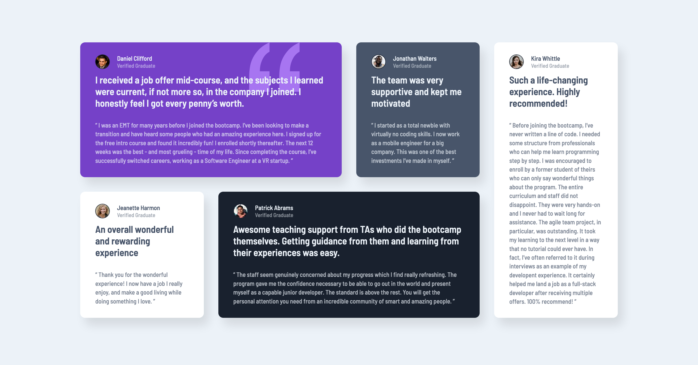

# Frontend Mentor - Testimonials grid section solution

This is a solution to the [Testimonials grid section challenge on Frontend Mentor](https://www.frontendmentor.io/challenges/testimonials-grid-section-Nnw6J7Un7). Frontend Mentor challenges help you improve your coding skills by building realistic projects.

## Table of contents

- [Overview](#overview)
  - [The challenge](#the-challenge)
  - [Screenshot](#screenshot)
  - [Links](#links)
- [My process](#my-process)
  - [Built with](#built-with)
  - [What I learned](#what-i-learned)
  - [Continued development](#continued-development)
  - [Useful resources](#useful-resources)

## Overview

### The challenge

Users should be able to:

- View the optimal layout for the site depending on their device's screen size

### Screenshot



### Links

- Live Site URL: [Add live site URL here](https://your-live-site-url.com)

## My process

### Built with

- Semantic HTML5 markup
- CSS custom properties
- Flexbox
- CSS Grid
- Mobile-first workflow
- Pixel Perfect Pro (Chrome Extension)

### What I learned

- This challenge was a good practice for me to understand CSS grid layout with trials and errors.

```css
/* Parent block - a wrapper for cards */
section.wrapper {
  display: grid;
  grid-template-columns: repeat(4, 1fr);
  row-gap: 0;
  column-gap: 3rem;
}

/* Child blocks - card inside the wrapper - assigning each grid*/
.card-1 {
  grid-column: 1/3;
  grid-row: 1;
}
.card-2 {
  grid-column: 3;
  grid-row: 1;
}
.card-3 {
  grid-column: 1;
  grid-row: 2;
}
.card-4 {
  grid-column: 2/4;
  grid-row: 2;
}
.card-5 {
  grid-column: 4;
  grid-row: 1/3;
}
```

### Continued development

- Styling the whole block was rather straightforward, but styling and adjusting each element such as images and letters in the cards were tricky. I'll continue working on flex and grid layouts and positioning each element and component.

### Useful resources

- [MDN Wed Docs - Grid](https://developer.mozilla.org/en-US/docs/Web/CSS/grid) - This helped me for CSS Grid Layout. Not only did the documentation teach me the concepts of grid layout, but it provided a list of the grid CSS properties, which are readily available.
